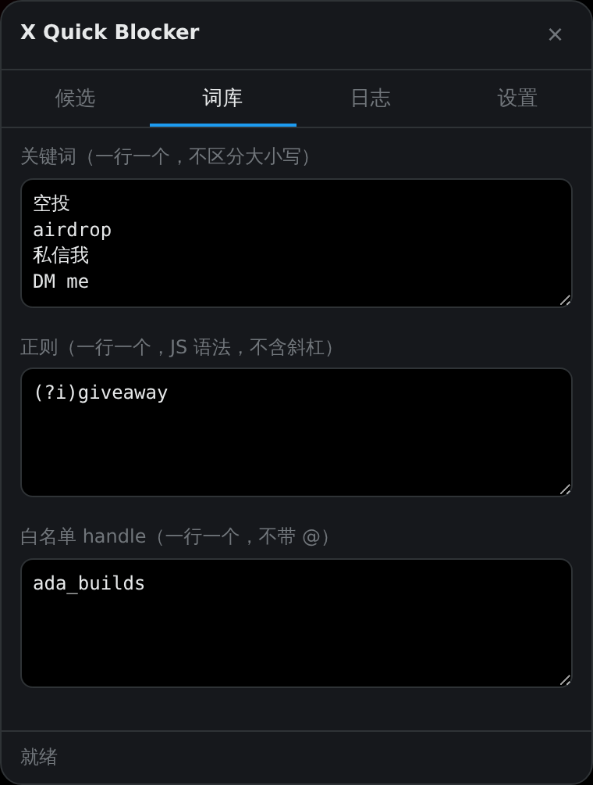
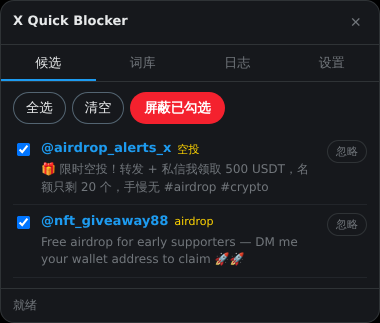
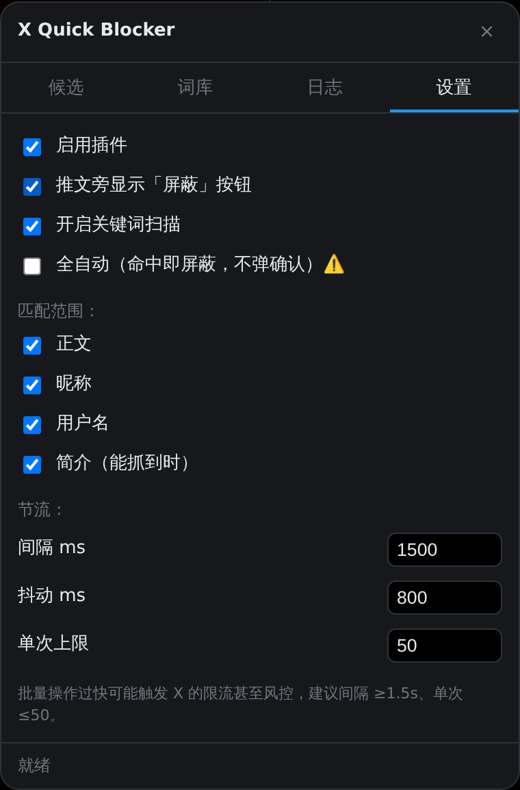
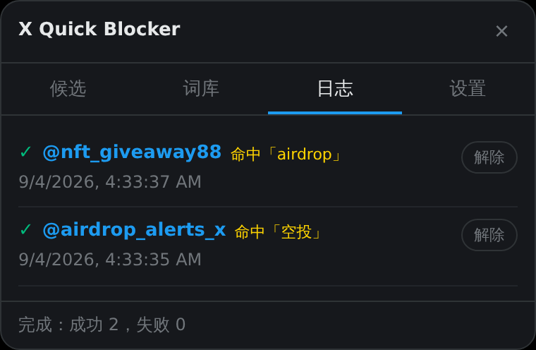

# X Quick Blocker

在 X (Twitter) 上快速屏蔽用户的 Chrome 扩展：**每条推文旁加一个「屏蔽」按钮**，以及**按关键词扫描时间线、确认后批量屏蔽**。

不需要 X 的 API key，不需要付费 API tier，不上传任何数据到第三方。


> 本文所有截图来自本地演示页面（用于展示界面），不是真实时间线。

## 功能

- **一键屏蔽** —— 每条推文的操作栏最右边多一个红色「屏蔽」按钮，点一下直接拉黑作者，省掉「⋯ → 屏蔽 → 确认」三步
- **关键词批量屏蔽** —— 关键词 / 正则匹配正文、昵称、用户名、简介，命中的账号进候选列表，**你确认后**才执行
- **节流与退避** —— 逐个执行、间隔可调、单次上限、429 自动指数退避
- **白名单 + 操作日志 + 一键撤销** —— 误伤能捞回来

## 安装

暂未上架 Chrome 商店，手动加载：

1. 下载本仓库（`Code → Download ZIP`）并解压到一个**固定目录**（别放临时文件夹，Chrome 每次启动都要读它）
2. 打开 `chrome://extensions/`
3. 右上角打开 **开发者模式**
4. 点 **加载已解压的扩展程序**，选中解压出来的目录
5. 打开 x.com（需已登录），页面右下角会出现 🛡 按钮

> **装好后先随便点开一个用户主页一次。** 插件需要从这一次访问里学到 X 的内部查询参数（`UserByScreenName` 的 queryId），学到后会存在本地，之后一直有效。跳过这步可能会遇到「拿不到 user_id」。

## 使用

### 1. 一键屏蔽单个用户

打开 x.com，每条推文的操作栏最右边会多一个「屏蔽」按钮，点一下即可。成功后按钮变成灰色的「已屏蔽」。


### 2. 配置关键词

点右下角 🛡 打开面板 → **词库** 页：



- **关键词**：一行一个，不区分大小写，子串匹配
- **正则**：一行一个，JS 正则语法，不要带首尾斜杠。想降低误伤就用组合条件，例如 `(?=.*空投)(?=.*私信)` 表示两个词同时出现才算命中
- **白名单**：一行一个 handle（不带 `@`），永不屏蔽

> 只匹配正文很容易误伤——批评某个词的人也会命中。实践下来，**匹配昵称和用户名比匹配正文准得多**（营销号的名字通常就写着 airdrop / giveaway）。

### 3. 扫描并批量屏蔽

到 **设置** 页打开「开启关键词扫描」，然后正常往下刷时间线。命中的推文左边会出现红色竖条，对应账号自动进入 **候选** 列表：



检查一遍，取消掉不想屏蔽的（或点「忽略」移出列表），然后点 **屏蔽已勾选**。确认后开始逐个执行，底部状态栏显示进度，中途随时可以「停止」。

### 4. 调节流速

**设置** 页可以调间隔、抖动和单次上限：



默认间隔 1500ms + 最多 800ms 随机抖动、单次上限 50。**不建议调到 1s 以下**——屏蔽接口有频次限制，太快会 429（触发后插件会自动退避重试），极端情况下账号可能被要求验证。

「全自动」开关默认关闭。打开后命中即屏蔽、不弹确认，误伤风险显著升高，建议先用半自动跑几天、把词库调准了再考虑。

### 5. 查看日志 / 撤销

**日志** 页记录每次屏蔽：谁、什么时候、命中了哪个词、成功还是失败。误伤了点「解除」即可取消屏蔽。



## 技术实现

- MV3，两段 content script：
  - `src/inject.js` 跑在 MAIN world，**只读**地 hook `fetch` / `XHR`，做三件事：抓 X 网页自己用的 `authorization` 头（避免硬编码 bearer 过期）、从时间线 GraphQL 响应里抽 `screen_name → rest_id` 映射、从请求 URL 里学习 GraphQL 的 `queryId`。它不修改任何请求或响应内容。
  - `src/content.js` 跑在 ISOLATED world，负责 UI、匹配和调用接口。
- 屏蔽走 X 网页版自己的内部接口 `POST /i/api/1.1/blocks/create.json`（`user_id=...`），带页面 cookie + `x-csrf-token: ct0`；解除走 `blocks/destroy.json`。
- **user_id 的解析链**（页面 DOM 里只有 `@handle`，没有数字 id）：
  1. hook 缓存的 `screen_name → rest_id`（大多数情况走这条，零额外请求）
  2. `GET /i/api/graphql/<queryId>/UserByScreenName` —— queryId 由 hook 从观察到的请求 URL 里学习（X 每次发版都会变，不能硬编码）；`features` 参数缺哪些，X 会在报错里列出来，代码据此自动补全并重试
  3. 老的 `1.1/users/show.json`（现已 404，仅作兜底）
  4. 都拿不到时，直接用 `screen_name=` 调 blocks 接口
- 词库、日志、id 缓存全部存在 `chrome.storage.local`，不出本机。

## 风险与注意

- **这是私有接口，不是公开 API。** X 改版可能随时失效，届时需要改 `src/content.js` 里的 endpoint / header。
- **批量操作有风控风险。** 屏蔽接口有频次限制，短时间大量调用会 429，极端情况下账号可能被要求验证或临时限制。默认参数已经比较保守，别为了快去调它。
- 自动化账号操作在 X 的自动化规则下属于灰区。自用、低频、针对骚扰和营销内容，风险较低；大规模使用请自行权衡。
- 关键词误伤很常见，**强烈建议保持半自动模式**（默认），执行前扫一眼候选列表。

## 目录

```
manifest.json
popup.html / popup.js     浏览器工具栏的快捷开关
src/inject.js             MAIN world hook（抓 token / user id / queryId）
src/content.js            主逻辑 + 面板 UI
src/panel.css             样式
docs/                     README 截图
```

## License

MIT
