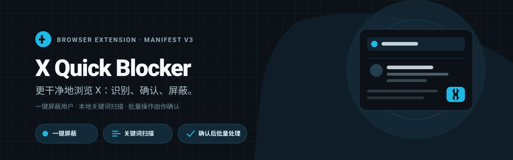
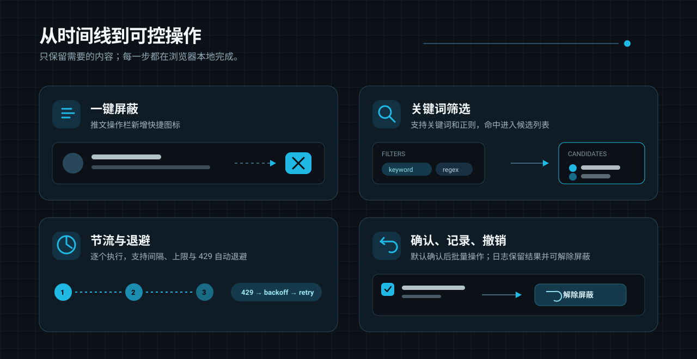

[](https://developer.chrome.com/docs/extensions/develop/migrate/what-is-mv3) [](LICENSE) [](https://www.google.com/chrome/) [](https://www.microsoft.com/edge)

# X Quick Blocker — X / Twitter 一键屏蔽 & 关键词批量拉黑 Chrome 扩展

**X Quick Blocker** 是一款开源、免费、纯本地运行的 Chrome 扩展（Manifest V3），用于在 **X（原 Twitter）** 上快速屏蔽骚扰、广告、擦边引流账号：**每条推文旁加一个「屏蔽」按钮（one-click block）**，以及**按关键词 / 正则表达式扫描时间线、确认后批量屏蔽（keyword & regex batch block）**。

不需要 X 的 API key，不需要付费 API tier，不上传任何数据到第三方，也不会把你加入任何黑名单共享网络——所有词库、日志、缓存都只存在你自己的浏览器里。适合用来清理**同城引流、色情营销、加密货币空投诈骗（crypto airdrop scam）、私信骚扰**等垃圾账号，是 X/Twitter 官方「屏蔽」「静音」功能之外的批量效率工具。

`X Quick Blocker` a.k.a. **X blocker / Twitter blocker Chrome extension**, **X keyword filter**, **Twitter spam blocker**, **X mass block tool** — free & open source (MIT), no login server, no tracking.


> 本文截图来自真实登录的 X 账号与真实时间线（内容均为公开推文），用于展示插件真实运行效果。

## 快速导航

- [功能](#功能)
- [安装](#安装)
- [使用](#使用)
- [技术实现](#技术实现)
- [风险与注意](#风险与注意)
- [常见问题 FAQ](#常见问题-faq)
- [目录结构](#目录结构)

## 功能



- **一键屏蔽** —— 每条推文的操作栏最右边多一个「斜杠人形」图标，点一下直接拉黑作者，省掉「⋯ → 屏蔽 → 确认」三步。图标默认与 X 其它操作图标同色，悬停变红并显示提示
- **关键词批量屏蔽** —— 关键词 / 正则匹配正文、昵称、用户名、简介，命中的账号进候选列表，**你确认后**才执行
- **节流与退避** —— 逐个执行、间隔可调、单次上限、429 自动指数退避
- **白名单 + 操作日志 + 一键撤销** —— 误伤能捞回来

## 安装

暂未上架 Chrome 商店，手动加载：

1. 下载本仓库（`Code → Download ZIP`）并解压到一个**固定目录**（别放临时文件夹，Chrome 每次启动都要读它）
2. 打开 `chrome://extensions/`
3. 右上角打开 **开发者模式**
4. 点 **加载已解压的扩展程序**，选中解压出来的目录
5. 打开 x.com（需已登录），页面右下角会出现 🛡 按钮

> **装好后先随便点开一个用户主页一次。** 插件需要从这一次访问里学到 X 的内部查询参数（`UserByScreenName` 的 queryId），学到后会存在本地，之后一直有效。跳过这步可能会遇到「拿不到 user_id」。

## 使用

### 1. 一键屏蔽单个用户

打开 x.com，每条推文的操作栏最右边会多一个「斜杠人形」图标，点一下即可。

图标不带文字，靠 tooltip 说明用途——悬停时显示「屏蔽 @用户名」，跟随浏览器语言自动切换。**整个面板（候选 / 词库 / 日志 / 设置）以及扩展名称、描述都已本地化**，内置英文、简体中文、繁体中文、日文，见 `_locales/`。缺语言包时回落英文。

状态用颜色和图形区分：静默态灰色、悬停红色、执行中转圈、成功变绿勾、失败变黄色感叹号（悬停可看失败原因，点击重试）。屏蔽成功后该作者的推文会直接从页面移除。


### 2. 配置关键词

点右下角 🛡 打开面板 → **词库** 页：


- **关键词**：一行一个，不区分大小写，子串匹配
- **正则**：一行一个，JS 正则语法，不要带首尾斜杠。想降低误伤就用组合条件，例如 `(?=.*空投)(?=.*私信)` 表示两个词同时出现才算命中
- **白名单**：一行一个 handle（不带 `@`），永不屏蔽

> 只匹配正文很容易误伤——批评某个词的人也会命中。实践下来，**匹配昵称和用户名比匹配正文准得多**（营销号的名字通常就写着 airdrop / giveaway）。

### 3. 扫描并批量屏蔽

到 **设置** 页打开「开启关键词扫描」，然后正常往下刷时间线。命中的推文左边会出现红色竖条，对应账号自动进入 **候选** 列表：


检查一遍，取消掉不想屏蔽的（或点「忽略」移出列表），然后点 **屏蔽已勾选**。确认后开始逐个执行，底部状态栏显示进度，中途随时可以「停止」。

### 4. 调节流速

**设置** 页可以调间隔、抖动和单次上限：


默认间隔 1500ms + 最多 800ms 随机抖动、单次上限 50。**不建议调到 1s 以下**——屏蔽接口有频次限制，太快会 429（触发后插件会自动退避重试），极端情况下账号可能被要求验证。

屏蔽成功后，该账号在当前页面上的推文和评论会立即从 DOM 里移除——X 自己不会刷新已渲染的节点，评论区尤其明显，不移除的话根本看不出到底屏蔽成没成。不想要这个行为可以在设置里关掉。

「全自动」开关默认关闭。打开后命中即屏蔽、不弹确认，误伤风险显著升高，建议先用半自动跑几天、把词库调准了再考虑。

### 5. 查看日志 / 撤销

**日志** 页记录每次屏蔽：谁、什么时候、命中了哪个词、成功还是失败。误伤了点「解除」即可取消屏蔽。


## 技术实现

- MV3，两段 content script：
  - `src/inject.js` 跑在 MAIN world，**只读**地 hook `fetch` / `XHR`，做三件事：抓 X 网页自己用的 `authorization` 头（避免硬编码 bearer 过期）、从时间线 GraphQL 响应里抽 `screen_name → rest_id` 映射、从请求 URL 里学习 GraphQL 的 `queryId`。它不修改任何请求或响应内容。
  - `src/content.js` 跑在 ISOLATED world，负责 UI、匹配和调用接口。
- 屏蔽走 X 网页版自己的内部接口 `POST /i/api/1.1/blocks/create.json`（`user_id=...`），带页面 cookie + `x-csrf-token: ct0`；解除走 `blocks/destroy.json`。
- **user_id 的解析链**（页面 DOM 里只有 `@handle`，没有数字 id）：
  1. hook 缓存的 `screen_name → rest_id`（大多数情况走这条，零额外请求）
  2. `GET /i/api/graphql/<queryId>/UserByScreenName` —— queryId 由 hook 从观察到的请求 URL 里学习（X 每次发版都会变，不能硬编码）；`features` 参数缺哪些，X 会在报错里列出来，代码据此自动补全并重试
  3. 老的 `1.1/users/show.json`（现已 404，仅作兜底）
  4. 都拿不到时，直接用 `screen_name=` 调 blocks 接口
- 词库、日志、id 缓存全部存在 `chrome.storage.local`，不出本机。

## 风险与注意

- **这是私有接口，不是公开 API。** X 改版可能随时失效，届时需要改 `src/content.js` 里的 endpoint / header。
- **屏蔽接口有频次限制。** 触发 429 后插件会对**当前这个账号**指数退避重试（最多 3 次），不会跳过它。
- **批量操作有风控风险。** 屏蔽接口有频次限制，短时间大量调用会 429，极端情况下账号可能被要求验证或临时限制。默认参数已经比较保守，别为了快去调它。
- 自动化账号操作在 X 的自动化规则下属于灰区。自用、低频、针对骚扰和营销内容，风险较低；大规模使用请自行权衡。
- 关键词误伤很常见，**强烈建议保持半自动模式**（默认），执行前扫一眼候选列表。

## 常见问题 FAQ

**这个 X/Twitter 屏蔽插件收费吗？** 不收费，MIT 开源协议，源码全部在本仓库，不联网上传任何数据。

**怎么批量屏蔽 X（推特）上的营销号 / 擦边引流账号？** 在 [词库](#2-配置关键词) 页填关键词或正则，开启 [关键词扫描](#3-扫描并批量屏蔽) 后正常刷时间线，命中账号会进候选列表，确认后一键批量屏蔽。

**和 X 官方自带的「屏蔽」「静音」有什么区别？** 官方功能只能一个一个手动点；本插件在此基础上加了**批量**、**关键词/正则自动识别**、**屏蔽后立即清理页面上的相关推文和评论**，以及**误屏蔽一键撤销**。

**会不会被 X 判定为自动化账号导致封号？** 插件只调用 X 网页版自己在用的内部接口，模拟正常点击频率（默认间隔 1.5s+ 随机抖动），不做批量注册、批量关注等高风险行为；但仍建议保持默认的保守参数，见 [风险与注意](#风险与注意)。

**支持 Edge / 其它 Chromium 内核浏览器吗？** 支持，Manifest V3 标准扩展，Edge、Brave、Arc 等 Chromium 内核浏览器均可加载。

## 目录结构

```
manifest.json
popup.html / popup.js     浏览器工具栏的快捷开关
src/inject.js             MAIN world hook（抓 token / user id / queryId）
src/content.js            主逻辑 + 面板 UI
src/panel.css             样式
_locales/                 界面文案多语言（en / zh_CN / zh_TW / ja，69 条）
docs/                     README 截图
```

## 隐私

不收集、不上传任何数据到开发者或第三方，详见 [PRIVACY.md](PRIVACY.md)。

## License

MIT
